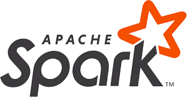

# learn-apache-spark

Learn Apache Spark Java

This repo to demonstrate some features of Apache Spark like RDD, SQL, Streaming, ...

---

[Apache Spark™](https://spark.apache.org/) is a multi-language engine for executing data engineering, data science, and machine learning on single-node machines or clusters

## Apache Spark features

- Batch/streaming data: Unify the processing of your data in batches and real-time streaming, using your preferred language: Python, SQL, Scala, Java or R.
- SQL analytics: Execute fast, distributed ANSI SQL queries for dashboarding and ad-hoc reporting. Runs faster than most data warehouses. Apache Spark™ is built on an advanced distributed SQL engine for large-scale data.
- Machine learning: Train machine learning algorithms on a laptop and use the same code to scale to fault-tolerant clusters of thousands of machines.
- Data science at scale: Perform Exploratory Data Analysis (EDA) on petabyte-scale data without having to resort to downsampling

## Demo

### RDD

- Demo: [apache-spark-rdd-demo](/apache-spark-rdd-demo)

- Documentation: [Resilient Distributed Dataset (RDD)](https://spark.apache.org/docs/latest/rdd-programming-guide.html)

### Spark SQL

- Demo: [apache-spark-sql-demo](/apache-spark-sql-demo)

- Documentation: [Spark SQL](https://spark.apache.org/docs/latest/sql-programming-guide.html)

### Streaming

- Demo: [apache-spark-streaming-demo](/apache-spark-streaming-demo)

- Documentation: [Structured Streaming](https://spark.apache.org/docs/latest/structured-streaming-programming-guide.html),
  [Spark Streaming](https://spark.apache.org/docs/latest/streaming-programming-guide.html)

## References
- [Spark Document](https://spark.apache.org/docs/latest/)
- [Apache Spark for Java Developers](https://udemy.com/course/apache-spark-for-java-developers)