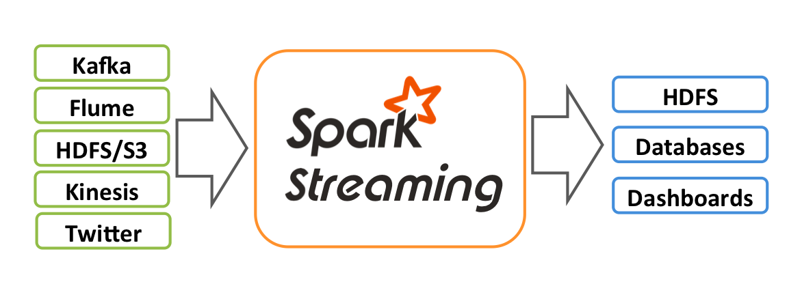
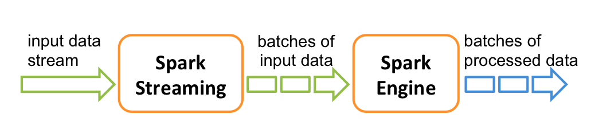

# learn-apache-spark

Learn Apache Spark Java 

This repo to demonstrate some features of Apache Spark like RDD, SQL, Streaming, ...

---

[Apache Spark™](https://spark.apache.org/) is a multi-language engine for executing data engineering, data science, and machine learning on single-node machines or clusters

## Apache Spark features

- Batch/streaming data: Unify the processing of your data in batches and real-time streaming, using your preferred language: Python, SQL, Scala, Java or R.
- SQL analytics: Execute fast, distributed ANSI SQL queries for dashboarding and ad-hoc reporting. Runs faster than most data warehouses. Apache Spark™ is built on an advanced distributed SQL engine for large-scale data.
- Machine learning: Train machine learning algorithms on a laptop and use the same code to scale to fault-tolerant clusters of thousands of machines.
- Data science at scale: Perform Exploratory Data Analysis (EDA) on petabyte-scale data without having to resort to downsampling

### RDD

**Demo**: [apache-spark-rdd-demo](/apache-spark-rdd-demo)

At a high level, every Spark application consists of a driver program that runs the user’s main function and executes various parallel operations on a cluster. The main abstraction Spark provides is a [Resilient Distributed Dataset (RDD)](https://spark.apache.org/docs/latest/rdd-programming-guide.html), which is a collection of elements partitioned across the nodes of the cluster that can be operated on in parallel. RDDs are created by starting with a file in the Hadoop file system (or any other Hadoop-supported file system), or an existing Scala collection in the driver program, and transforming it. Users may also ask Spark to persist an RDD in memory, allowing it to be reused efficiently across parallel operations. Finally, RDDs automatically recover from node failures.

A second abstraction in Spark is shared variables that can be used in parallel operations. By default, when Spark runs a function in parallel as a set of tasks on different nodes, it ships a copy of each variable used in the function to each task. Sometimes, a variable needs to be shared across tasks, or between tasks and the driver program. Spark supports two types of shared variables: broadcast variables, which can be used to cache a value in memory on all nodes, and accumulators, which are variables that are only “added” to, such as counters and sums.

### Spark SQL

**Demo**: [apache-spark-rdd-demo](/apache-spark-sql-demo)

[Spark SQL](https://spark.apache.org/docs/latest/sql-programming-guide.html) is a Spark module for structured data processing. Unlike the basic Spark RDD API, the interfaces provided by Spark SQL provide Spark with more information about the structure of both the data and the computation being performed. Internally, Spark SQL uses this extra information to perform extra optimizations. There are several ways to interact with Spark SQL including SQL and the Dataset API. When computing a result, the same execution engine is used, independent of which API/language you are using to express the computation. This unification means that developers can easily switch back and forth between different APIs based on which provides the most natural way to express a given transformation.

### Streaming

**Demo**: [apache-spark-rdd-demo](/apache-spark-streaming-demo)

**Structured Streaming**
  
[Structured Streaming](https://spark.apache.org/docs/latest/structured-streaming-programming-guide.html) is a scalable and fault-tolerant stream processing engine built on the Spark SQL engine. You can express your streaming computation the same way you would express a batch computation on static data. The Spark SQL engine will take care of running it incrementally and continuously and updating the final result as streaming data continues to arrive. You can use the Dataset/DataFrame API in Scala, Java, Python or R to express streaming aggregations, event-time windows, stream-to-batch joins, etc. The computation is executed on the same optimized Spark SQL engine. Finally, the system ensures end-to-end exactly-once fault-tolerance guarantees through checkpointing and Write-Ahead Logs. In short, Structured Streaming provides fast, scalable, fault-tolerant, end-to-end exactly-once stream processing without the user having to reason about streaming. 
    
Internally, by default, Structured Streaming queries are processed using a micro-batch processing engine, which processes data streams as a series of small batch jobs thereby achieving end-to-end latencies as low as 100 milliseconds and exactly-once fault-tolerance guarantees. However, since Spark 2.3, we have introduced a new low-latency processing mode called Continuous Processing, which can achieve end-to-end latencies as low as 1 millisecond with at-least-once guarantees. Without changing the Dataset/DataFrame operations in your queries, you will be able to choose the mode based on your application requirements.

**Spark Streaming**

[Spark Streaming](https://spark.apache.org/docs/latest/streaming-programming-guide.html) is an extension of the core Spark API that enables scalable, high-throughput, fault-tolerant stream processing of live data streams. Data can be ingested from many sources like Kafka, Kinesis, or TCP sockets, and can be processed using complex algorithms expressed with high-level functions like map, reduce, join and window. Finally, processed data can be pushed out to filesystems, databases, and live dashboards. In fact, you can apply Spark’s machine learning and graph processing algorithms on data streams.

Internally, it works as follows. Spark Streaming receives live input data streams and divides the data into batches, which are then processed by the Spark engine to generate the final stream of results in batches.

Spark Streaming provides a high-level abstraction called discretized stream or DStream, which represents a continuous stream of data. DStreams can be created either from input data streams from sources such as Kafka, and Kinesis, or by applying high-level operations on other DStreams. Internally, a DStream is represented as a sequence of RDDs.

## References
- [Spark Document](https://spark.apache.org/docs/latest/)
- [Apache Spark for Java Developers](https://udemy.com/course/apache-spark-for-java-developers)