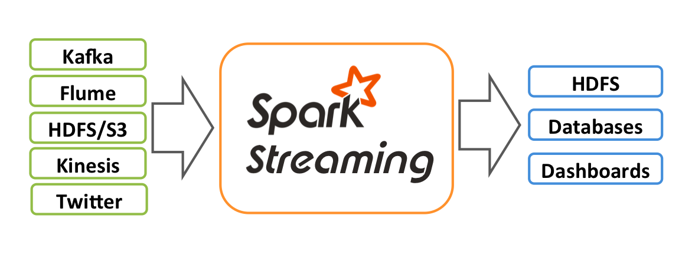
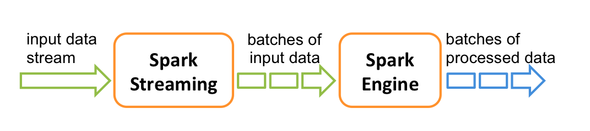

# Streaming

## Structured Streaming
  
[Structured Streaming](https://spark.apache.org/docs/latest/structured-streaming-programming-guide.html) is a scalable and fault-tolerant stream processing engine built on the Spark SQL engine. 
You can express your streaming computation the same way you would express a batch computation on static data. 
The Spark SQL engine will take care of running it incrementally and continuously and updating the final result as streaming data continues to arrive. 
You can use the Dataset/DataFrame API in Scala, Java, Python or R to express streaming aggregations, event-time windows, stream-to-batch joins, etc. 
The computation is executed on the same optimized Spark SQL engine. Finally, the system ensures end-to-end exactly-once fault-tolerance guarantees through checkpointing and Write-Ahead Logs. 
In short, Structured Streaming provides fast, scalable, fault-tolerant, end-to-end exactly-once stream processing without the user having to reason about streaming. 
    
Internally, by default, Structured Streaming queries are processed using a micro-batch processing engine, which processes data streams as a series of small batch jobs thereby achieving end-to-end latencies as low as 100 milliseconds and exactly-once fault-tolerance guarantees. 
However, since Spark 2.3, we have introduced a new low-latency processing mode called Continuous Processing, which can achieve end-to-end latencies as low as 1 millisecond with at-least-once guarantees. 
Without changing the Dataset/DataFrame operations in your queries, you will be able to choose the mode based on your application requirements.

## Spark Streaming

[Spark Streaming](https://spark.apache.org/docs/latest/streaming-programming-guide.html) is an extension of the core Spark API that enables scalable, high-throughput, fault-tolerant stream processing of live data streams. 
Data can be ingested from many sources like Kafka, Kinesis, or TCP sockets, and can be processed using complex algorithms expressed with high-level functions like map, reduce, join and window. 
Finally, processed data can be pushed out to filesystems, databases, and live dashboards. In fact, you can apply Spark’s machine learning and graph processing algorithms on data streams.

Internally, it works as follows. Spark Streaming receives live input data streams and divides the data into batches, which are then processed by the Spark engine to generate the final stream of results in batches.

Spark Streaming provides a high-level abstraction called discretized stream or DStream, which represents a continuous stream of data. 
DStreams can be created either from input data streams from sources such as Kafka, and Kinesis, or by applying high-level operations on other DStreams. Internally, a DStream is represented as a sequence of RDDs.
